# PRP 11: Authentication Fix - Multi-Agent Execution Plan

## 🤖 Agent Assignment & Task Breakdown

### Phase 1: Planning & Analysis (0-30 min)
**Lead Agent: Planning Agent**
```
Tasks:
1. Parse PRP 11 requirements
2. Identify critical path items
3. Create task dependency graph
4. Assign tasks to specialized agents
```

### Phase 2: Parallel Development (30 min - 3 hours)

#### 🎨 Frontend Agent Tasks
**Working on: React/TypeScript components**
```
Task 1: Create AuthContext (Priority: HIGH)
- File: frontend/src/contexts/AuthContext.tsx
- Create auth provider with user state
- Implement useAuth hook
- Add session persistence logic
- Handle token refresh

Task 2: Fix ProfileOnboarding (Priority: CRITICAL)
- File: frontend/src/components/ProfileOnboarding.tsx
- Debug email input issue
- Fix controlled component state
- Add validation and error handling
- Improve form UX

Task 3: Add Auth Guards (Priority: HIGH)
- File: frontend/src/middleware/auth.ts
- Create route protection
- Handle unauthorized access
- Preserve redirect URLs
```

#### 🔧 Backend Agent Tasks
**Working on: Python/FastAPI endpoints**
```
Task 1: Fix Session Management (Priority: CRITICAL)
- File: backend/app/api/auth/routes.py
- Fix /api/auth/callback cookie setting
- Ensure proper SameSite attributes
- Add secure flag for production

Task 2: Implement Token Refresh (Priority: HIGH)
- File: backend/app/api/auth/refresh.py
- Create /api/auth/refresh endpoint
- Implement refresh token logic
- Add token expiry handling

Task 3: Add Session Validation (Priority: HIGH)
- File: backend/app/api/auth/validate.py
- Create /api/auth/validate endpoint
- Check token validity
- Return user data if valid
```

#### 🗄️ Database Agent Tasks
**Working on: Schema and migrations**
```
Task 1: Update User Sessions Table
- Add refresh_token column
- Add token_expires_at column
- Create migration script
- Update session queries
```

### Phase 3: Testing (3-4 hours)

#### 🧪 Unit Test Agent Tasks
```
Task 1: Test AuthContext
- Test login/logout flows
- Test token refresh
- Test error handling
- Mock API calls

Task 2: Test Profile Form
- Test input validation
- Test form submission
- Test error states
```

#### 🔄 Integration Test Agent Tasks
```
Task 1: Test OAuth Flow
- Test Google OAuth callback
- Test session creation
- Test profile setup flow
- Test token persistence
```

#### 🌐 E2E Test Agent Tasks
```
Task 1: Test Complete User Journey
- Login → Profile Setup → Dashboard
- Session persistence across refresh
- Logout and re-login
- Deep linking with auth
```

### Phase 4: Review & Security (4-5 hours)

#### 🔒 Security Agent Tasks
```
Task 1: Security Audit
- Check for XSS vulnerabilities
- Validate CSRF protection
- Ensure secure cookie settings
- Review token storage method
```

#### 👀 Code Review Agent Tasks
```
Task 1: Review All Changes
- Check code quality
- Ensure best practices
- Verify error handling
- Confirm type safety
```

### Phase 5: Documentation & Deployment (5-6 hours)

#### 📚 Documentation Agent Tasks
```
Task 1: Update Documentation
- Document auth flow
- Create troubleshooting guide
- Update API documentation
- Add configuration guide
```

#### 🚀 DevOps Agent Tasks
```
Task 1: Deploy Changes
- Run CI/CD pipeline
- Deploy to staging
- Run smoke tests
- Deploy to production
- Monitor for issues
```

## 📊 Execution Timeline

```mermaid
gantt
    title PRP 11 Multi-Agent Execution
    dateFormat HH:mm
    section Planning
    Planning Agent        :done, 00:00, 30m
    
    section Development
    Frontend Agent        :active, 00:30, 2h30m
    Backend Agent         :active, 00:30, 2h30m
    Database Agent        :00:30, 1h
    
    section Testing
    Unit Test Agent       :01:30, 1h30m
    Integration Test      :02:00, 1h30m
    E2E Test Agent        :02:30, 1h30m
    
    section Review
    Security Agent        :03:00, 1h
    Code Review Agent     :03:30, 1h
    
    section Deploy
    Documentation Agent   :04:00, 1h
    DevOps Agent         :04:30, 1h30m
```



## 🔄 Agent Communication Flow

```
Orchestrator
    ├── Planning Agent (analyzes PRP)
    │   └── Creates task list
    │
    ├── Parallel Execution Group 1
    │   ├── Frontend Agent (AuthContext, ProfileFix)
    │   ├── Backend Agent (Session, Tokens)
    │   └── Database Agent (Schema updates)
    │
    ├── Parallel Execution Group 2
    │   ├── Unit Test Agent
    │   ├── Integration Test Agent
    │   └── E2E Test Agent
    │
    ├── Quality Gate
    │   ├── Security Agent (audit)
    │   └── Code Review Agent (review)
    │
    └── Deployment
        ├── Documentation Agent
        └── DevOps Agent
```

## 📈 Expected Outcomes

### Success Metrics
- ✅ All 8 acceptance criteria met
- ✅ 100% test coverage for auth code
- ✅ Zero security vulnerabilities
- ✅ <500ms auth check time
- ✅ Deployment within 6 hours

### Deliverables
1. Working AuthContext with hooks
2. Fixed ProfileOnboarding component
3. Secure session management
4. Token refresh mechanism
5. Comprehensive test suite
6. Updated documentation
7. Production deployment

## 🚦 Risk Mitigation

### Potential Blockers
1. **Email Input Complexity**: Frontend agent adds extensive debugging
2. **Session Cookie Issues**: Backend agent tests multiple cookie configurations
3. **Migration Risks**: Database agent creates rollback script
4. **Production Issues**: DevOps agent implements feature flag

### Fallback Plan
- If any critical task fails, orchestrator reassigns to backup agent
- Automatic rollback if production metrics degrade
- All changes behind feature flag for gradual rollout

## 🎯 Current Status
**Ready to Execute**: All agents are configured and ready to process PRP 11. The orchestrator will coordinate parallel execution to fix authentication issues within 6 hours.